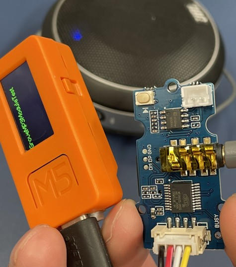

# GrooveMP3ModuleTest

## References 

  - [Grove - MP3 v3.0 - Seeed Wiki](https://wiki.seeedstudio.com/Grove-MP3-v3/)
  - [Seeed_Serial_MP3_Player/WT2003S_Player.h at master · Seeed-Studio/Seeed_Serial_MP3_Player · GitHub](https://github.com/Seeed-Studio/Seeed_Serial_MP3_Player/blob/master/src/WT2003S_Player.h)
  - [Seeed_Serial_MP3_Player/WT2003S_Player.cpp at master · Seeed-Studio/Seeed_Serial_MP3_Player · GitHub](https://github.com/Seeed-Studio/Seeed_Serial_MP3_Player/blob/master/src/WT2003S_Player.cpp)
  - [Grove-MP3 V3-Music Playerを使用してみた【前編】 - uepon日々の備忘録](https://uepon.hatenadiary.com/entry/2019/12/27/223818)
  - [Grove-MP3 V3-Music Playerを使用してみた【後編】 - uepon日々の備忘録](https://uepon.hatenadiary.com/entry/2019/12/29/164445)

## Copyright and license
Copyright (c) 2022 yoggy

Released under the [MIT license](LICENSE)